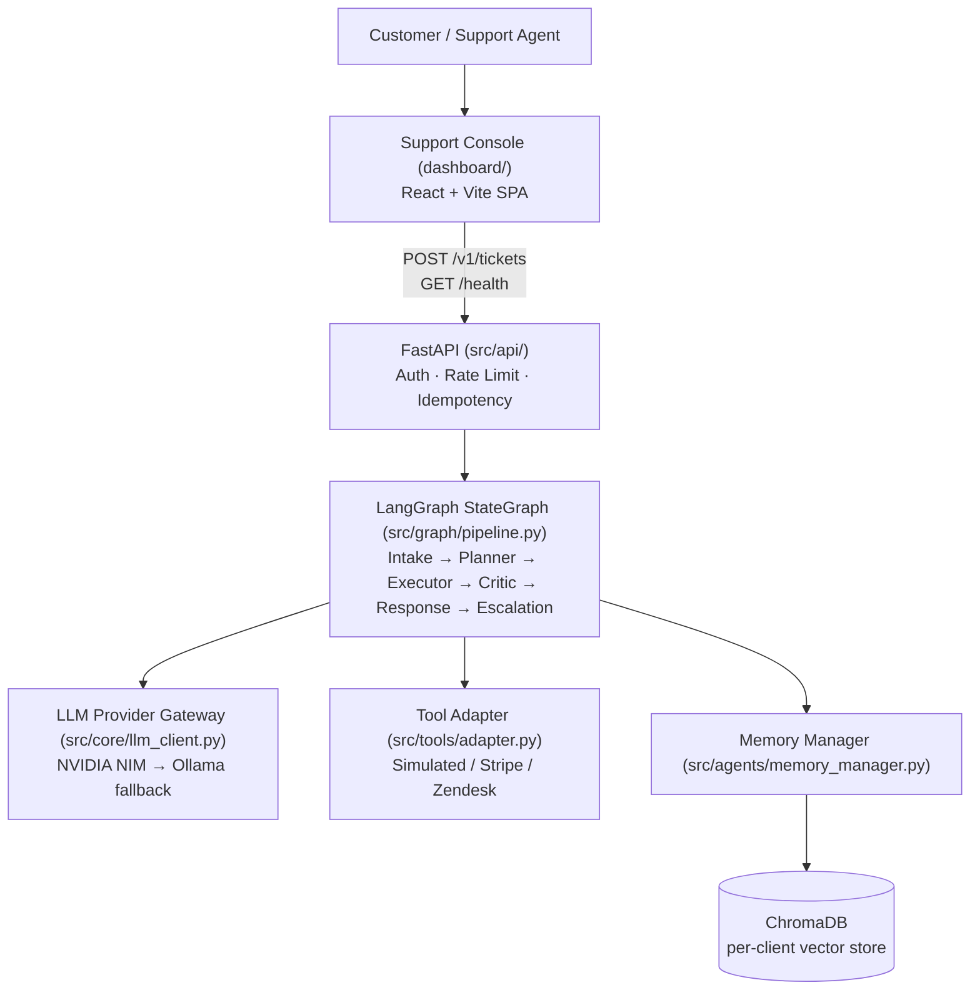

# Architecture

This document explains how the system fits together: the frontend, the backend, the memory
system, the LangGraph orchestration layer, and — the detail that makes this repository unusual —
why there are **two parallel implementations** of the same agent pipeline (a Research Track and a
Production Track) and why they deliberately do not share runtime code.

See also: [README.md](README.md) for the project overview and getting-started steps,
[DEPLOYMENT.md](DEPLOYMENT.md) for how to run this in production, and
[PROJECT_STRUCTURE.md](PROJECT_STRUCTURE.md) for the full annotated folder map.

---

## 1. High-Level System Diagram



The LangGraph `StateGraph` is the orchestration hub: each node it runs (Planner, Executor, Critic,
Response) calls out to the LLM Provider Gateway, the Tool Adapter, and the Memory Manager as
needed — these are peer subsystems the graph invokes, not a strict linear pipeline. Full breakdown
of every component below.

---

## 2. Technology Stack

| Category | Technology |
|---|---|
| **Frontend** | React 18, TypeScript (strict), Vite, Tailwind CSS v4, shadcn/ui (Radix primitives), TanStack Query + TanStack Table, React Hook Form + Zod, React Router v7, Recharts, React Flow (`@xyflow/react`), MSW (mock service layer) |
| **Backend** | Python 3.11+, [uv](https://github.com/astral-sh/uv), FastAPI, Uvicorn, Pydantic v2 |
| **Orchestration** | LangGraph `StateGraph` (Production Track); plain Python functions per baseline (Research Track), plus one partial LangGraph-based ReAct control baseline |
| **LLM** | NVIDIA NIM (`meta/llama-3.1-8b-instruct` — Planner/Critic), local Ollama (`qwen2.5:3b-instruct` — Intake/Response), Gemini Flash (offline LLM-as-judge only, never in the live pipeline) |
| **Memory** | Custom `MemoryManager[T]` interface, 5 typed entry schemas (Episodic, Tool-Failure, Plan-Success, Escalation, Policy — research-track), per-client isolated collections |
| **Database / Vector Store** | ChromaDB, embedded and persistent, one collection per `{client_id}_{suffix}` |
| **Observability** | OpenTelemetry (spans + metrics, no-op until configured), structured JSON logging |
| **Research tooling** | Synthetic ticket dataset (200 tickets, 6 intent clusters), `scipy` (χ² significance testing), `matplotlib` / `numpy` (paper figures, not a project dependency) |
| **Testing** | `pytest`, `ruff` (backend); TypeScript strict mode + `oxlint` (frontend); no dedicated E2E suite yet |
| **Deployment** | GitHub Actions (`.github/workflows/`) for CI; Vercel/Netlify (frontend static host); Render/Railway/Azure App Service (backend ASGI host) — see [DEPLOYMENT.md](DEPLOYMENT.md) |

---

## 3. The Two-Track Split

| | `experiments/` (Research Track) | `src/` (Production Track) |
|---|---|---|
| Purpose | Produce the paper's numbers | Serve real traffic |
| Consumes | Synthetic dataset, oracle failure labels (eval-only) | Real/simulated tool backends, real client requests |
| Orchestration | Plain Python functions per baseline | LangGraph `StateGraph` |
| Memory | Read/written inline in each baseline module | `src/agents/memory_manager.py` — typed functions in front of the same store |
| LLM calls | Duplicated `_call_llm()`/rate-limiter per baseline file | Single `LLMProviderGateway` with per-role fallback chains |
| Feature flags | Env-var gated ablations (`ENABLE_CONDITIONED_CRITIC`, etc.) | Always-on best-known configuration (no ablation flags) |

Production **never imports from** `experiments/`. Each production agent is a hand-ported,
typed rewrite of the equivalent research logic (e.g. `src/agents/critic_replanner.py`'s
`_classify_failure` mirrors `experiments/memory_augmented_v2.py::_classify_failure` verbatim) —
onto proper Pydantic contracts, LangGraph nodes, and OpenTelemetry spans. This keeps the research
code free to run risky ablations and keeps production code held to a stricter contract, without
either one blocking the other.

Both tracks share exactly one thing: the underlying `src/memory/` `MemoryManager[T]` /
`ChromaStore` implementation and the `src/tools/` simulated handlers — the actual business logic
of "what a tool call returns" and "how memory persists" is not duplicated.

---

## 4. Request Lifecycle

Step-by-step path of a single ticket through the Production Track, from submission to memory
write:

1. **Customer Request** — the Support Console's New Ticket page (or any API client) submits
   `POST /v1/tickets`.
2. **API** (`src/api/`) — `X-API-Key` resolves to a `client_id`; the request is checked against the
   idempotency cache (a replayed `ticket_id` short-circuits here) and the per-client rate limiter,
   then handed to `run_ticket()`.
3. **Intake** — sanitizes the message (heuristic prompt-injection filter), classifies intent,
   extracts entities. Every downstream node reads the sanitized text, never the raw input.
4. **Planner** — retrieves relevant memory through the Memory Manager (Episodic + Plan-Success on
   the Production Track; Policy + Tool-Failure + Episodic via Context Fusion on the Research
   Track's Policy Memory path), then calls the LLM Provider Gateway to build a tool-call
   **Execution DAG**.
5. **Executor** — dispatches each DAG layer's tool calls through the Tool Adapter (simulated, or
   real Stripe/Zendesk backends).
6. **Critic / Replanner** — reads only `success` / `data` / `error` off each tool result (never the
   oracle-only `failure_type`), classifies any failure, and decides resolved vs. replan. On
   unresolved, loops back to step 4 — up to `MAX_ITERATIONS = 3`.
7. **Response** — once resolved (or iterations exhausted), the LLM Provider Gateway drafts the
   customer-facing reply.
8. **Escalation** — if still unresolved after `MAX_ITERATIONS`, summarizes the ticket for a human
   agent instead of returning a low-confidence auto-reply.
9. **Memory Write** — the Memory Manager persists the outcome: Episodic memory always; Plan-Success
   memory on a successful resolution (template-abstracted, ticket-specific values stripped);
   Tool-Failure memory on a diagnosed failure — into the per-client Chroma vector store.

See `tests/test_pipeline_integration.py` for the automated coverage of this flow (happy path,
replan-then-resolve, escalate-after-exhaustion).

---

## 5. Component Responsibilities

### Agent pipeline (7 agents)

```
Intake → Planner → Executor → Critic/Replanner ─┬─→ Response → Escalation (if unresolved) → Memory Write
                       ↑_______________________ (replan) ┘
```

1. **Intake Agent** — classifies ticket intent, extracts entities, runs a heuristic
   prompt-injection filter on the raw customer message before anything downstream sees it.
2. **Planner Agent** — builds a tool-call Execution DAG (`list[list[str]]` layers,
   dependency-ordered). Retrieves from Episodic/Plan-Success (and, on the Research Track's Policy
   Memory path, Policy) memory before planning. Never calls tools directly.
3. **Executor Agent** — the only agent that calls tools, dispatching through an injected
   `DispatchFn` so production and research can each supply their own
   (`SimulatedToolAdapter`/`RealToolAdapter` vs. `ToolRegistry`).
4. **Critic/Replanner Agent** — reads only `success`/`data`/`error` off a tool result (never the
   oracle-only `failure_type` field), classifies the failure category from observable symptoms,
   and either confirms resolution or triggers a bounded replan (`MAX_ITERATIONS = 3`).
5. **Memory Manager Agent** — retrieval, write, dedup/reinforcement, and scheduled pruning across
   every memory store, wrapped so the Planner/Critic never touch `ChromaStore` directly.
6. **Response Agent** — drafts the customer-facing reply.
7. **Escalation Agent** — decides human handoff and summarizes for a human agent when the Critic
   gives up after exhausting replanning attempts.

### FastAPI layer (`src/api/`)

- `POST /v1/tickets`, `GET /health` — the only two real, implemented HTTP endpoints today.
- `auth.py` — `X-API-Key` header → `client_id`, via `Settings.api_keys` (`API_KEYS` env var).
  `client_id` is never taken from the request body.
- `rate_limit.py` — per-client sliding-window inbound limiter; **rejects with 429**, distinct from
  the LLM gateway's outbound limiter (which blocks/waits instead of rejecting).
- `idempotency.py` — keyed on `(client_id, ticket_id)`, so a retried submission replays the cached
  response instead of re-dispatching tools (e.g. double-issuing a refund). Checked *before* the
  rate limiter, so retries of an already-processed ticket don't burn rate-limit budget.
- Both the limiter and idempotency cache are **in-process, single-worker state** — a documented
  limitation (see [ENTERPRISE_ARCHITECTURE.md](ENTERPRISE_ARCHITECTURE.md) §3); a multi-worker
  deployment needs a shared store (Redis token bucket / durable idempotency table) first.

### LLM Provider Gateway (`src/core/llm_client.py`)

Per-role **ordered fallback chain** of provider/model pairs (e.g. Planner/Critic try NVIDIA NIM,
then fall back to local Ollama), each gated by its own proactive sliding-window rate limiter and a
circuit breaker (opens after 3 consecutive failures, half-opens after a 60s cooldown). This
replaces relying on reactive retry/backoff alone, which caused multi-minute stalls during
development against NIM's ~40 req/min free-tier ceiling.

### Tool layer (`src/tools/`, `src/tools/adapter.py`)

`ToolAdapter` is a one-method interface (`dispatch(tool_name, params) -> ToolResult`) with two
implementations:
- **`SimulatedToolAdapter`** (default) — calls the same deterministic simulated handlers used by
  the Research Track directly, no failure injection.
- **`RealToolAdapter`** — composes one `ToolBackend` per tool: `CrmBackend`/`OrderBackend`/
  `RefundBackend` call Stripe (Customers / PaymentIntents / Refunds), `KbSearchBackend` calls
  Zendesk Guide's help-center search. Each backend **fails closed** — a `ToolResult(success=False,
  error=...)`, never an exception — when its credentials are unset or the provider call errors.
  Swapping a vendor means rewriting that one backend's `call()`; nothing upstream changes.

### Observability (`src/core/telemetry.py`, `src/core/logging.py`)

Structured JSON logging is always on. OpenTelemetry spans/metrics are a **true no-op** until
`OTEL_EXPORTER_OTLP_ENDPOINT` is set — no collector is required for local development, and an
earlier version that defaulted to a live console exporter was deliberately reverted because it
spammed every test run. Spans wrap every agent `run()`, every tool dispatch, every LLM call, and
the whole graph run; metrics cover ticket counts, replanning-count histogram, LLM provider
fallback count, and a memory-size gauge.

### Compliance (`src/core/pii.py`, `src/jobs/retention.py`)

`redact_pii()` is a best-effort regex scrub (email/phone/SSN/card-like patterns) applied inside
the Memory Manager — not retrofitted into the store itself — before anything reaches Chroma.
`src/jobs/retention.py` is a scheduled-job entrypoint (`uv run python -m src.jobs.retention`) that
prunes memory per `client_id` per `Settings.memory_retention_days`; it is deliberately an
externally-scheduled job (cron/k8s CronJob), not a background thread in the API process.

---

## 6. Memory System

| Store | Schema (interface contract) | Written by |
|---|---|---|
| `EpisodicMemory` | `{ticket_id, intent, plan_dag, outcome, timestamp}` | every resolved/escalated ticket |
| `ToolFailureMemory` | `{tool_name, failure_type, context, fix_applied}` | Critic/Replanner on a diagnosed failure |
| `PlanSuccessMemory` | `{intent_cluster, dag_template, success_rate}` | on success, template-abstracted (ticket-specific values stripped before write) |
| `EscalationMemory` | `{ticket_id, human_correction, original_response}` | human-feedback loop (not yet wired up) |
| `PolicyMemory` (Research Track, Contribution 2) | `{policy_id, intent_cluster, workflow_template, dependency_graph, tool_constraints, usage_count, ...}` | upserted (not appended) by deterministic `policy_id` |

- **Isolation is per-client by default** — a compliance requirement, not merged across clients
  without explicit sign-off. `ClientStoreRegistry` caches one `ClientStore` (bundling all stores)
  per `client_id`.
- `src/memory/client_store.py`'s `ChromaStore` implements the abstract `MemoryManager[T]`
  interface (`write`/`retrieve`/`prune`) over one Chroma collection per `{client_id}_{suffix}`,
  JSON-serialized pydantic entries.
- **Policy Memory is deliberately not under `src/memory/`** — it lives in a new top-level
  `memory/` package (sibling to `experiments/`), since this contribution isn't wired into
  production yet. Its store (`memory/policy_store.py`) is built directly on ChromaDB's
  `collection.upsert(ids=...)` rather than reusing `ChromaStore.write()` (which always mints a
  fresh UUID), because `policy_id` is a deterministic key and the design requires "update the
  matching policy or create a new one." It still reuses the same shared Chroma client and
  collection-naming convention as every other memory type.
- **Context Fusion** (`experiments/context_fusion.py`) merges top-3 Policy + top-2 Tool-Failure +
  top-3 Episodic retrievals into a single `PlanningContext` for the Planner prompt — the mechanism
  under test for "does policy-based memory generalize better than ticket-based memory."
- **Result: a null result, reported transparently.** A controlled ablation (Policy Memory vs.
  `v2_full` — architecturally identical, differing only in retrieval source) found **no
  statistically significant resolution-rate difference at any failure rate tested**, with the
  point estimate favoring the simpler ticket-based baseline at two of three tiers. The bulk of
  Policy Memory's originally observed advantage over the older `memory_augmented` baseline is
  attributable to template abstraction (shared by both v2 arms), not to policy-based retrieval
  itself. See [`paper/results.md`](paper/results.md) (Tables 8–11) and
  [`paper/discussion.md`](paper/discussion.md) for the full analysis, and
  [Policy_Memory_Implementation_Plan.md](Policy_Memory_Implementation_Plan.md) for the original
  design this evaluation tested.

---

## 7. LangGraph (Production Orchestration)

`src/graph/pipeline.py`'s `build_pipeline()` / `run_ticket()` wires all 7 agents into a LangGraph
`StateGraph`, porting `experiments/memory_augmented_v2.py`'s best-performing configuration
(conditioned Critic + template-abstracted memory + tool-reliability scoring — all always-on here,
where the Research Track keeps them behind ablation flags).

```
intake → planner → executor → critic ──(unresolved, < MAX_ITERATIONS)──▶ planner   [loop]
                                   └──(resolved, or iterations exhausted)──▶ response
                                                                                 └─▶ escalation (if unresolved)
                                                                                       └─▶ write_memory
```

`MAX_ITERATIONS = 3`. See `tests/test_pipeline_integration.py` for the shape of a full run (happy
path, replan-then-resolve, escalate-after-exhaustion). `src/core/dag.py`'s `ExecutionDAG`
(pydantic) formalizes the `list[list[str]]` layer/dependency shape used ad hoc across
`experiments/` as the typed Planner→Executor contract.

---

## 8. Research Track

`experiments/baselines/` (memoryless, static ReAct, LangGraph-ReAct control) and
`experiments/memory_augmented.py` / `memory_augmented_v2.py` each expose a self-contained
`run(ticket, registry) -> BaselineResult` function with the same shape: extract entities → build a
tool-call DAG → dispatch tools through `ToolRegistry` (which injects synthetic failures via a
seeded `failure_rate`) → critic pass decides resolved vs. replan → loop up to `MAX_ITERATIONS` →
write to memory (memory-augmented variants only).

`experiments/memory_augmented.py` (Contribution 1) is **frozen** — it is the baseline the paper
cites; new work goes into `memory_augmented_v2.py` or new files, never edits to the frozen file.
`v2` adds three env-var-gated features (conditioned Critic, template-abstracted memory, tool
reliability scoring) so `scripts/run_experiment.py` can run each as an ablation
(`v2_critic_only`, `v2_template_only`, `v2_full`) of the same file, plus Contribution 2 (Policy
Memory) behind its own `ENABLE_POLICY_MEMORY` flag as the `policy_memory` baseline.

`scripts/run_experiment.py` iterates `{baseline} × {failure_rate}` over the synthetic dataset,
appending one JSON record per ticket to `experiments/results/{baseline}_{failure_rate}.jsonl`.
`scripts/compute_summary.py` / `analyze_results.py` / `analyze_policy_memory.py` post-process
those results into the resolution-rate, memory-hit, and (for Policy Memory) reuse/transfer tables.
Historical result snapshots are archived under `archive/experiment-backups/`, not deleted, as the
recorded provenance for specific paper-cited numbers.

**Critical invariant**: Critic code — in both tracks — must only read `success`/`data`/`error`
off a tool result. `failure_type` is oracle/eval-only metadata used to score prediction accuracy
after the fact; feeding it to the Critic would invalidate the replanning research result.

---

## 9. Frontend

Support Console (`dashboard/`) is a React 18 + TypeScript + Vite SPA. Two things distinguish it
from a typical CRUD dashboard:

- **One real endpoint, fourteen mocked ones, by explicit design.** `src/services/endpoints/tickets.ts`
  calls the actual FastAPI backend (`POST /v1/tickets`, `GET /health`). Every other page's data
  comes from MSW-intercepted handlers in `src/services/mock/`, documented endpoint-by-endpoint in
  [`dashboard/API_CONTRACT.md`](dashboard/API_CONTRACT.md) as the implementation target for
  whoever builds those real endpoints later. Swapping a page from mock to real is a service-layer
  change; no consuming component or TanStack Query hook changes.
- **The Experiment Dashboard is grounded in real data.** Rather than fabricated comparison
  numbers, it's seeded from this repository's actual `experiments/results/*.jsonl` output, so the
  displayed baseline comparisons reflect the paper's real numbers.

Key architectural pieces: `AppShell` (sidebar/topbar/command palette), a `DataTable<T>` shared
across every list page (URL-synced sort/filter/pagination, keyboard row navigation), an
`ExecutionGraph` (React Flow) for the Live Agent Execution page with a controlled-selection
pattern driven by `onNodesChange` (so mouse and keyboard selection stay in sync), and a
two-tier `ErrorBoundary` (root-level + per-route) with route-level code splitting.

Mocks are gated by environment: **on by default in development, off by default in production
builds** (`import.meta.env.DEV`, overridable via `VITE_ENABLE_MOCKS`) — see
[DEPLOYMENT.md](DEPLOYMENT.md) for why this matters and how to verify it.
