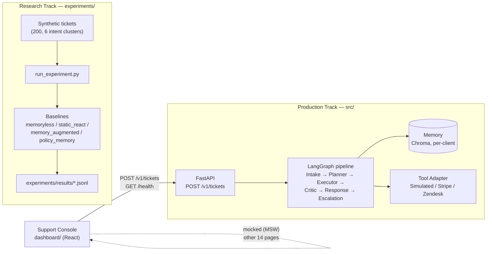

# Enterprise AI Customer Support Platform

Production-grade multi-agent customer support platform built with LangGraph, FastAPI, React, and
advanced memory systems.

## Highlights

- Multi-Agent AI Architecture
- LangGraph Orchestration
- Enterprise Memory System
- Policy Memory Research
- FastAPI Backend
- React Enterprise Dashboard
- Production UI/UX
- Accessibility Tested
- Research Paper Included

---

Formally, the **Adaptive Multi-Agent Customer Support System** (the name used in `AGENTS.md`, the
research paper, and its citation) — a research system and production-track reference
implementation for a **self-improving,
memory-augmented multi-agent customer support pipeline** — plus **Support Console**, a full
enterprise operations dashboard for monitoring and interacting with it.

The core research question: does **memory-augmented dynamic replanning** reduce ticket failure
rate and replanning overhead compared to memoryless and static-ReAct baselines — and does
*policy-based* memory (reusable workflow templates) generalize better than *ticket-based* memory
(replaying past examples)? The target output is a workshop paper plus a production-track client
system, and this repository contains both.

> **Status:** Research Track is experiment-complete for both contributions. **Contribution 1**
> (memory-augmented vs. memoryless vs. static-ReAct) has paper-citable results. **Contribution 2**
> (Policy Memory) is fully evaluated, including a controlled ablation that isolates retrieval
> source as the only variable — the honest finding is a **null result**: no statistically
> significant resolution-rate difference between policy-based and ticket-based memory once the
> surrounding architecture is held constant (see [`paper/results.md`](paper/results.md) and
> [`paper/discussion.md`](paper/discussion.md)). The Production Track (`src/`) is fully implemented
> through Phase 5 of the enterprise roadmap. See [Roadmap & Future Work](#roadmap--future-work).

---

## Overview

This project has three parts that share code but serve different purposes:

1. **Research harness** (`experiments/`) — runs controlled comparisons between baseline agent
   architectures (memoryless, static ReAct, memory-augmented, policy-memory) against a synthetic
   ticket dataset with injectable tool failures, and produces the metrics behind the paper.
2. **Production pipeline** (`src/`) — a LangGraph-orchestrated port of the best-performing
   research baseline into a real, typed, testable service: FastAPI HTTP layer, per-client auth
   and rate limiting, OpenTelemetry tracing, pluggable real tool backends (Stripe, Zendesk), PII
   redaction, and a scheduled memory-retention job.
3. **Support Console** (`dashboard/`) — a 15-page enterprise operations dashboard (React + Vite)
   for support ops teams and researchers: live ticket submission against the real backend, a
   React Flow visualization of an agent's execution trace, memory/tool/analytics explorers, and
   an experiment-comparison view grounded in this repository's own research results.

The two tracks intentionally **do not share runtime code** — `src/` is a from-scratch, typed port
of validated research logic, not an import of `experiments/`. See [ARCHITECTURE.md](ARCHITECTURE.md)
for the full rationale and data flow.

---

## Architecture



Full breakdown (agent roles, memory schema, LangGraph wiring, research-vs-production divergence)
lives in [ARCHITECTURE.md](ARCHITECTURE.md).

---

## Key Features

### Multi-agent pipeline
- **7 typed agents**: Intake, Planner, Executor, Critic/Replanner, Memory Manager, Response,
  Escalation — each a single `run(TypedInput) -> TypedOutput` function, never raw strings between
  agents.
- **Memory-augmented replanning**: Episodic, Tool-Failure, Plan-Success, Escalation, and (research
  track) Policy memory, isolated per client in Chroma.
- **LLM provider gateway** with per-role ordered fallback chains, a proactive sliding-window rate
  limiter, and a circuit breaker — not just reactive retry/backoff.
- **Pluggable tools**: simulated handlers for research/demo use, or real Stripe (CRM/orders/refunds)
  and Zendesk Guide (KB search) backends behind the same interface.

### Support Console dashboard
- Dashboard, Conversations, Conversation Detail, **Live Agent Execution** (React Flow graph of an
  actual LangGraph run), Memory Explorer, Tool Monitoring, Analytics, Experiment Dashboard (real
  research results), Client Management, Settings, Audit Logs, Profile, Help Center, and a
  production **Ticket Submission** page wired to the real `POST /v1/tickets` endpoint.
- Full keyboard accessibility (skip links, focus-trapped dialogs, arrow-key graph/table
  navigation), light/dark themes, and responsive layouts from 390px to 1920px.
- Every other page is served by a documented, swappable mock layer (MSW) — see
  [`dashboard/API_CONTRACT.md`](dashboard/API_CONTRACT.md) — so the UI ships at full fidelity
  ahead of backend endpoints that don't exist yet, with zero fabricated experiment numbers (the
  Experiment Dashboard reads this repo's actual `experiments/results/`).

---

## Screenshots

> _Add screenshots to a `docs/screenshots/` directory and update the paths below._

| Dashboard | Live Agent Execution |
|---|---|
| `docs/screenshots/dashboard.png` | `docs/screenshots/live-execution.png` |

| Memory Explorer | Analytics |
|---|---|
| `docs/screenshots/memory-explorer.png` | `docs/screenshots/analytics.png` |

| Experiment Dashboard | Ticket Submission |
|---|---|
| `docs/screenshots/experiments.png` | `docs/screenshots/new-ticket.png` |

---

## Tech Stack

| Layer | Technology |
|---|---|
| Orchestration | [LangGraph](https://github.com/langchain-ai/langgraph) `StateGraph` |
| Backend API | [FastAPI](https://fastapi.tiangolo.com/) + Uvicorn, Python 3.11+, [uv](https://github.com/astral-sh/uv) |
| Data contracts | [Pydantic v2](https://docs.pydantic.dev/) — every inter-agent and API payload |
| LLM providers | NVIDIA NIM (Llama 3.1 8B — Planner/Critic), local Ollama (Qwen2.5 3B — Intake/Response), Gemini Flash (offline LLM-as-judge only) |
| Memory / vector store | [ChromaDB](https://www.trychroma.com/), per-client isolated collections |
| Real tool integrations | Stripe (CRM/orders/refunds), Zendesk Guide (KB search) |
| Observability | OpenTelemetry (tracing + metrics), structured JSON logging |
| Testing | pytest, ruff (backend); TypeScript strict mode, oxlint (frontend) |
| CI/CD | GitHub Actions (`.github/workflows/`) — type-check/lint/build on the frontend, ruff/pytest on the backend |
| Frontend framework | React 18 + TypeScript (strict) + Vite + Tailwind CSS v4 |
| Frontend components | shadcn/ui (Radix primitives), TanStack Query + TanStack Table, React Hook Form + Zod |
| Frontend routing / viz | React Router v7, Recharts, [@xyflow/react](https://reactflow.dev/) (React Flow) |
| Frontend mocking | MSW (Mock Service Worker) — the documented mock service layer, environment-gated off in production builds |

---

## Installation

### Prerequisites
- Python 3.11+ and [uv](https://github.com/astral-sh/uv)
- Node.js 20+ and npm
- (Optional, for local intake/response LLM calls) [Ollama](https://ollama.com/) running
  `qwen2.5:3b-instruct`

### Clone

```bash
git clone https://github.com/LikhithBusam/enterprise-ai-customer-support.git
cd enterprise-ai-customer-support
```

### Backend

```bash
uv sync                 # installs runtime + dev dependencies (pytest, ruff)
cp .env.example .env    # fill in your own keys — see Environment Variables below
uv run pytest           # optional: verify the install
```

### Frontend

```bash
cd dashboard
npm install
```

---

## Running

### Frontend (Support Console)

```bash
cd dashboard
npm run dev
```

Opens at **http://localhost:5173**. By default the mock service layer (MSW) is active in dev, so
every page works immediately with realistic generated data — no backend required. The one
exception is the **New Ticket** page, which calls the real backend below.

### Backend (production API)

```bash
uv run uvicorn src.api.main:app --host 0.0.0.0 --port 8000
```

Runs at **http://localhost:8000** (`GET /health`, `POST /v1/tickets`). Point the dashboard's
`VITE_API_BASE_URL` at this address to submit real tickets through the New Ticket page.

### Research experiments

```bash
uv run python -m scripts.run_experiment --limit 20                 # quick smoke test
uv run python -m scripts.run_experiment                            # full run, all baselines × failure rates
uv run python -m scripts.compute_summary                           # resolution-rate / memory-hit summary
uv run python -m scripts.analyze_policy_memory                     # Contribution 2 metrics
```

`scripts/run_experiment.py` makes real LLM calls by default and is rate-limited — always pass
`--limit` while iterating.

---

## Environment Variables

Copy `.env.example` to `.env` and fill in your own values. **Never commit real keys.**

| Variable | Used by | Notes |
|---|---|---|
| `LLM_PROVIDER` | research + production | `nim` (default) or `gemini` |
| `NVIDIA_API_KEY`, `NVIDIA_BASE_URL` | Planner/Critic (NIM) | free tier, ~40 req/min hard ceiling |
| `PLANNER_MODEL`, `CRITIC_MODEL` | Planner/Critic | e.g. `meta/llama-3.1-8b-instruct` |
| `OLLAMA_BASE_URL`, `INTAKE_MODEL` | Intake/Response (local) | e.g. `qwen2.5:3b-instruct` |
| `GEMINI_API_KEY` | offline LLM-as-judge only | 20 req/day free-tier cap — not used live |
| `CHROMA_PERSIST_DIR` | memory layer | local Chroma persistence path |
| `API_KEYS` | production API | `key1:client_a,key2:client_b` — `X-API-Key` → `client_id` map |
| `API_RATE_LIMIT_PER_MINUTE` | production API | per-client inbound limit, default 60 |
| `OTEL_EXPORTER_OTLP_ENDPOINT` | telemetry | unset = spans/metrics are true no-ops |
| `STRIPE_API_KEY` | real CRM/order/refund backend | unset = that backend fails closed |
| `ZENDESK_SUBDOMAIN`, `ZENDESK_EMAIL`, `ZENDESK_API_TOKEN` | real KB-search backend | unset = fails closed |

Dashboard-side variables (`dashboard/.env`, not committed): `VITE_API_BASE_URL`,
`VITE_ENABLE_MOCKS` (defaults to on in dev, **off in production builds** — see
[DEPLOYMENT.md](DEPLOYMENT.md)).

---

## Deployment

Short version: the dashboard is a static Vite build (deploy to Vercel/Netlify/any static host)
and the backend is a standard ASGI app (deploy to Render/Railway/Azure App Service, or any
container host, behind `uvicorn`/`gunicorn`). Full step-by-step instructions, environment variable
matrices per platform, and production-build verification steps are in
**[DEPLOYMENT.md](DEPLOYMENT.md)**.

---

## Folder Structure

```
enterprise-ai-customer-support/
├── src/                    # Production Track — LangGraph pipeline, FastAPI, typed agents
├── experiments/            # Research Track — baselines, experiment driver, ablations
├── memory/                 # Policy Memory (Contribution 2) — Research Track only
├── data/                   # Synthetic ticket dataset
├── scripts/                # Experiment runner, summary/analysis, dataset builder
├── tests/                  # pytest suite (per-agent, API, memory, DAG, telemetry, ...)
├── dashboard/               # Support Console — React + Vite frontend
│   ├── src/
│   │   ├── app/            # Router, providers, client context
│   │   ├── components/     # Shared UI (shadcn primitives, data-table, layout)
│   │   ├── features/       # One folder per page/domain
│   │   ├── services/       # Real + mocked API clients (the mock/real swap boundary)
│   │   └── types/          # Shared cross-feature TypeScript types
│   └── API_CONTRACT.md     # Documented contract for every mocked endpoint
├── paper/                   # Workshop paper drafts/assets
├── web/                     # Unrelated Next.js marketing site (not part of the pipeline)
├── AGENTS.md / CLAUDE.md    # Full project context, decisions, and status log
└── ENTERPRISE_ARCHITECTURE.md  # Sequenced production-readiness roadmap
```

Full annotated structure: **[PROJECT_STRUCTURE.md](PROJECT_STRUCTURE.md)**.

---

## Roadmap & Future Work

### Engineering roadmap

- [ ] Resolve a flagged numeric discrepancy between `AGENTS.md` and `paper/results.md` for the
  `memory_augmented` baseline at FR=0.3, then re-run the chi-square significance test before citing
  final numbers in the paper
- [ ] Add a LangGraph-based ReAct baseline as a reviewer-facing control (partial implementation exists)
- [ ] Escalation Agent human-feedback loop (writes to Escalation Memory — not wired up yet)
- [ ] Wire Policy Memory into the production pipeline (`ENTERPRISE_ARCHITECTURE.md` Phase 6) — now a
  **lower-priority, gated** item given the null result below; see Future Work
- [ ] Scale-out: containerize each agent as an independent service; swap Chroma → Qdrant at >1M vectors (Phase 7)
- [ ] Move off free-tier NVIDIA NIM (40 req/min ceiling) to a paid/dedicated inference endpoint

### Future work (research)

Policy Memory's controlled ablation found no statistically significant advantage over ticket-based
memory (see the Status note above and [`paper/discussion.md`](paper/discussion.md)). The
highest-priority next steps, in order, per
[`paper/future_work.md`](paper/future_work.md):

1. **Larger sample size / repeated trials** — the ablation's confidence intervals are wide enough
   that a real, smaller effect could exist undetected at n=200, single-run.
2. **Mechanism-level comparison of retrieved plan quality**, not just outcome — directly test
   whether Policy Memory's consistently farther retrieval distance causes worse suggested plans.
3. **Investigate why both `v2_full` and Policy Memory underperform `memory_augmented` at FR=0.7** —
   a new question raised by the ablation, suggesting the regression may be a property of the
   broader v2 architecture rather than specific to Policy Memory.
4. **Re-run all four baselines in one canonical environment** to remove the disclosed
   Python-version/OS mismatch between the original three baselines and the `v2_full`/Policy Memory
   runs (see [`paper/reproducibility.md`](paper/reproducibility.md)).

See [AGENTS.md](AGENTS.md) for the full, detailed status log this summary is drawn from.

---

## Documentation

| Document | Covers |
|---|---|
| [ARCHITECTURE.md](ARCHITECTURE.md) | Full technical design — frontend, backend, memory, LangGraph, both tracks |
| [DEPLOYMENT.md](DEPLOYMENT.md) | Production build, environment variables, Vercel, Render/Railway/Azure |
| [CONTRIBUTING.md](CONTRIBUTING.md) | Dev setup, ground rules, coding conventions, PR process |
| [PROJECT_STRUCTURE.md](PROJECT_STRUCTURE.md) | Annotated folder-by-folder map |
| [PORTFOLIO_SUMMARY.md](PORTFOLIO_SUMMARY.md) | One-page summary for interviews/resume discussions |
| [DEMO_SCRIPT.md](DEMO_SCRIPT.md) | 5- and 10-minute guided walkthroughs, plus common interview Q&A |
| [dashboard/API_CONTRACT.md](dashboard/API_CONTRACT.md) | Every mocked endpoint's documented request/response shape |
| [AGENTS.md](AGENTS.md) | Living project context and detailed status log |
| [ENTERPRISE_ARCHITECTURE.md](ENTERPRISE_ARCHITECTURE.md) | Sequenced production-readiness roadmap |

## Citation

This repository's Research Track targets a workshop paper (`paper/final_paper.md`), not yet
published or assigned a DOI/venue. If you reference this work before then, please cite the
repository directly:

```bibtex
@misc{policy_memory_2026,
  title  = {Policy Memory: An Ablation Study of Reusable Workflow Templates in
            Memory-Augmented Agentic Customer Support},
  author = {Busam, Likhith},
  year   = {2026},
  howpublished = {\url{https://github.com/LikhithBusam/enterprise-ai-customer-support}},
  note   = {Unpublished workshop paper draft; repository is the canonical source until publication}
}
```

This citation will be updated with formal venue/DOI details upon publication — see
[`paper/references.md`](paper/references.md) for the full reference list this work builds on.

## License

Released under the [MIT License](LICENSE).
