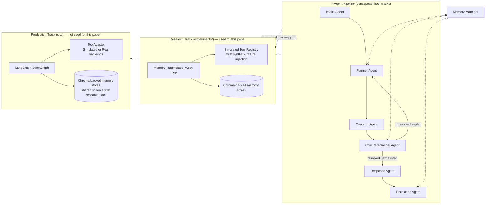
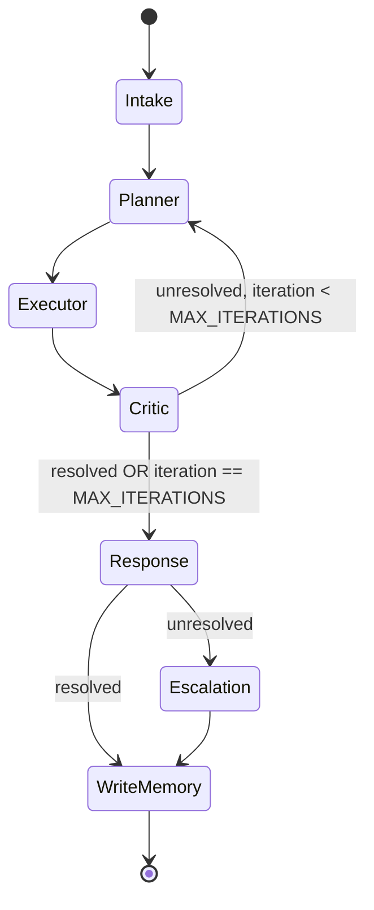
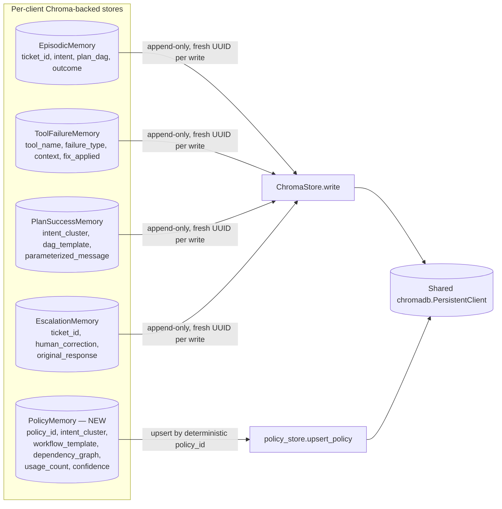
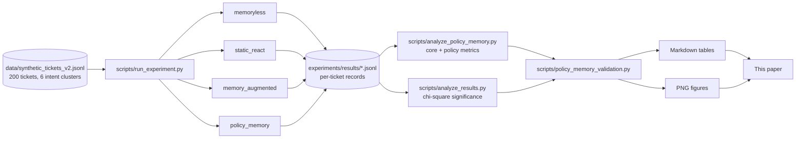

# Architecture

This system has **two parallel tracks that are not conflated**: `experiments/` (the research
harness that produced every result in this paper) and `src/` (a production LangGraph pipeline).
**All experiments reported in this paper ran through the research-track harness
(`experiments/memory_augmented_v2.py`'s iterative Python loop), not through the LangGraph graph
described below** — Policy Memory is not wired into production yet (see `future_work.md`). The
production architecture is included here for completeness, since it is the intended eventual home
for this contribution, not because it was used to generate any reported number.

## 1. Overall System Architecture



## 2. Production LangGraph Pipeline (`src/graph/pipeline.py`)



*Not used to generate this paper's results — shown for architectural completeness. Policy Memory's
production integration point (Phase 6 of `ENTERPRISE_ARCHITECTURE.md`) is the Planner node's
memory-retrieval call.*

## 3. Memory Architecture



Every store shares one Chroma client and the `{client_id}_{suffix}` per-client collection
convention. `PolicyMemory` is the only type stored via direct ChromaDB `upsert` rather than
`ChromaStore.write()`, because its identity (`policy_id`) is deterministic and reinforcement
requires updating an existing record rather than always appending a new one.

## 4. Policy Memory Workflow (write path)

```mermaid
flowchart TD
    Resolved([Ticket resolved]) --> Extract[Extract workflow_template\nfrom resolved DAG\n— tool names only, no ticket-specific values]
    Extract --> Dep[Build dependency_graph\nfrom tools present in workflow]
    Dep --> Hash[Compute deterministic policy_id\n= SHA256 intent_cluster + workflow_template]
    Hash --> Lookup{Existing policy\nwith this id?}
    Lookup -- yes --> Reinforce[usage_count += 1\nrunning-average tool_calls/replans\nconfidence += 0.05, capped 1.0\ncreated_from += ticket_id]
    Lookup -- no --> Create[usage_count = 1\nconfidence = 0.5\ncreated_from = [ticket_id]]
    Reinforce --> Upsert[collection.upsert by policy_id]
    Create --> Upsert
```

## 5. Research Evaluation Pipeline



*(See `methodology.md` for the Context Fusion and Planner Workflow diagrams — the two remaining
requested diagrams, placed there since they are discussed inline with the methodology text they
illustrate.)*
