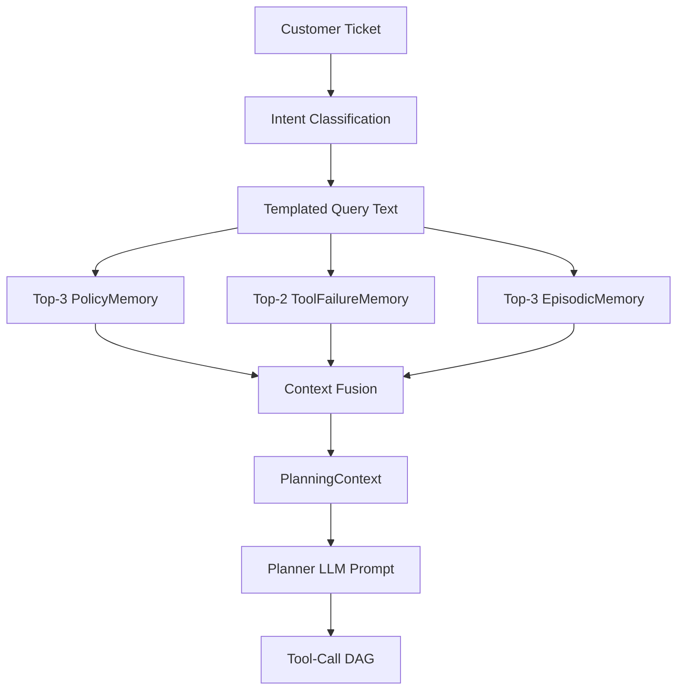
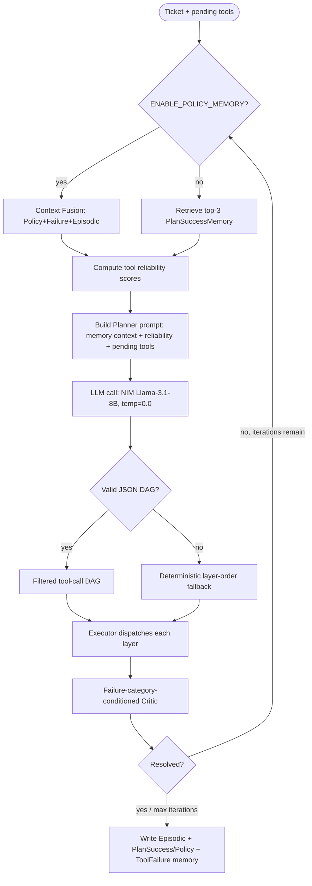
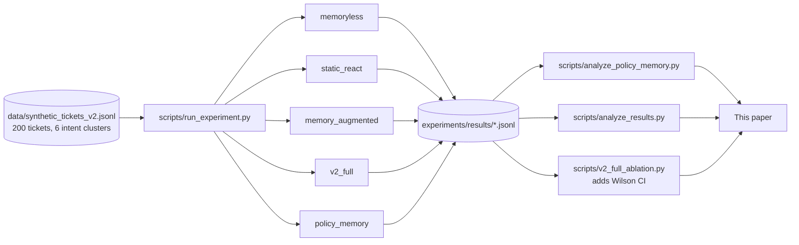

# Policy Memory: An Ablation Study of Reusable Workflow Templates in Memory-Augmented Agentic Customer Support

*Workshop paper draft — agentic AI / LLM tool-use track.*

*(Revised from an earlier draft titled "...for Generalizable Memory-Augmented..." after a
controlled ablation, described below, did not support that framing. This version reports the
corrected finding rather than the original one.)*

## Abstract

Memory-augmented LLM agents typically store and replay *ticket-specific* examples: a past
successful plan, keyed by a parameterized version of the request that produced it. This risks
memorization rather than generalization. We present **Policy Memory**, a memory type that stores
reusable *workflow policies* — an intent cluster's tool-call shape and dependency structure,
deliberately stripped of ticket-specific values — retrieved via a **Context Fusion** step that
merges top-3 Policy, top-2 Tool-Failure, and top-3 Episodic memories into the Planner's context.
We implement Policy Memory as a research-track extension of an existing memory-augmented
customer-support agent pipeline and evaluate it across 200 synthetic support tickets at three
synthetic tool-failure rates (0.0, 0.3, 0.7), using real LLM calls (NVIDIA NIM, Llama-3.1-8B).

Against `memory_augmented` (a ticket-based memory baseline lacking the conditioned Critic,
reliability scoring, and template abstraction that Policy Memory inherits), Policy Memory shows a
large, statistically significant advantage at FR=0.3 (90.0% vs. 73.0%, χ² p = 0.00002). However,
**a controlled ablation against `v2_full`** — architecturally identical, differing *only* in
retrieval source — **finds no statistically significant difference at any failure rate tested**
(FR=0.0: tied at 97.0%, p=1.0; FR=0.3: 95.0% vs. 90.0%, p=0.088; FR=0.7: 43.5% vs. 37.5%,
p=0.263), with point estimates at FR=0.3 and FR=0.7 favoring the simpler, ticket-based `v2_full`
baseline. Diagnostic evidence (near-identical memory hit rates between `v2_full` and Policy
Memory, both far above `memory_augmented`'s; measurably farther average retrieval distance for
Policy Memory at every condition) indicates the originally observed advantage is attributable
mainly to the surrounding v2 architecture — particularly template abstraction — rather than to
policy-based retrieval specifically. We report this null result transparently and identify what
would be needed to test the underlying hypothesis more conclusively.

---

## 1. Introduction

### 1.1 Motivation

LLM-based agentic systems increasingly handle multi-step tool-use tasks where a single wrong
tool call or misordered dependency can derail an entire task. Two ways to improve such agents are
(a) **dynamic replanning** — a critic that inspects tool results and revises the plan — and (b)
**memory augmentation** — retrieving from past experience rather than re-deriving a plan from
scratch. Memory augmentation as usually implemented stores *ticket-specific* examples, which risks
memorization: an agent that has effectively memorized near-duplicate requests may not generalize
to requests sharing an *intent* but differing in surface form. A prior phase of this project's
research observed exactly this symptom — memory-hit rate saturated by the second ticket, with no
learning curve.

### 1.2 Research Questions

- **RQ1:** Does memory-augmented dynamic replanning reduce ticket failure rate and replanning
  overhead relative to memoryless and static-ReAct baselines? *(established in prior work on this
  codebase; restated as the baseline this paper builds on.)*
- **RQ2:** Does *policy-based* memory generalize better than *ticket-based* memory, across a
  range of environmental failure conditions?

  **Answer, as measured:** Against `memory_augmented`, yes, significantly, at FR=0.3. Against
  `v2_full` — the architecturally matched control isolating retrieval source as the only
  variable — **no significant difference was found at any failure rate**, with point estimates at
  two of three conditions favoring ticket-based retrieval. §8 and §9 report this in full.

### 1.3 Contributions

1. **Policy Memory** (`PolicyMemory`): a memory type storing an intent cluster's tool-call shape,
   dependency structure, and reuse statistics, keyed by a **deterministic** identifier so a
   recurring workflow shape reinforces the same record rather than accumulating duplicates.
2. **Context Fusion**: a retrieval step merging top-3 Policy, top-2 Tool-Failure, and top-3
   Episodic memories into a single planning context.
3. **A controlled, multi-arm empirical evaluation**, including — critically — a properly isolated
   ablation (`v2_full` vs. `policy_memory`) that most such evaluations skip, using real LLM
   planner/critic calls with per-ticket instrumentation enabling fine-grained analysis.
4. **A transparently-reported null result**: the ablation does not support the hypothesis that
   policy-based memory generalizes better than ticket-based memory once the surrounding critic
   architecture is held constant, and we report this rather than retaining the more favorable but
   confounded original comparison as the paper's headline claim.

---

## 2. Related Work

**Agentic tool use and reasoning.** ReAct (Yao et al., 2022) interleaves reasoning traces with
tool-use actions; our `static_react` baseline is a fixed version of this pattern, included to
separate the effect of dynamic replanning from the effect of memory. ReWOO (Xu et al., 2023)
separates planning from execution; our DAG-based planner/executor split is similar in spirit, with
an added iterative Critic/Replanner loop. Toolformer (Schick et al., 2023) trains tool-use
decisions rather than prompting for them.

**Memory-augmented LLM agents.** Generative Agents (Park et al., 2023) use an episodic-memory
design close to this project's `EpisodicMemory` schema. MemGPT (Packer et al., 2023) treats
context as a memory hierarchy; our per-type Chroma stores are simpler by comparison. Reflexion
(Shinn et al., 2023) has an agent reflect on failure within a retry loop; our
failure-category-conditioned Critic is a narrower, cross-ticket analog. Voyager (Wang et al.,
2023) builds a growing skill library of reusable procedures — the closest prior work in spirit to
Policy Memory's core idea.

**Positioning.** This paper's contribution relative to Voyager's skill-library line of work is a
controlled, ablated comparison holding the surrounding agent architecture fixed and varying only
the memory type retrieved — and, distinctively, a report of what happened when that isolation was
actually performed: the intuitively appealing "reusable procedures beat replayed instances"
hypothesis was not supported once confounding architectural factors were controlled for.

*(Citation note: bibliographic details reflect well-established papers recalled from training
knowledge; exact venue/page/DOI formatting has not been re-verified against a live index — see
`references.md`.)*

---

## 3. Methodology

### 3.1 Experimental Design

Six arms were ultimately run for this paper: `memoryless`, `static_react`, `memory_augmented`,
`policy_memory`, and — for the controlled ablation — `v2_full`, each at three failure rates
(0.0, 0.3, 0.7), 200 tickets per cell.

| Arm | Memory retrieved | Critic | Reliability scoring | Template abstraction |
|---|---|---|---|---|
| `memoryless` | none | plain LLM critic | no | no |
| `static_react` | none | fixed ReAct loop | no | no |
| `memory_augmented` | `PlanSuccessMemory` (ticket-parameterized) + `ToolFailureMemory` | plain LLM critic | no | no |
| `v2_full` | `PlanSuccessMemory` (template-abstracted) + `ToolFailureMemory` | conditioned | yes | yes |
| `policy_memory` | Context Fusion: Policy + Failure + Episodic | conditioned | yes | yes |

`v2_full` and `policy_memory` are the **same implementation**
(`experiments/memory_augmented_v2.py`), differing by exactly one environment variable
(`ENABLE_POLICY_MEMORY`), verified directly against `scripts/run_experiment.py::run_baseline`
(lines 98–117): both set `ENABLE_CONDITIONED_CRITIC=1`, `ENABLE_TEMPLATE_ABSTRACTION=1`,
`ENABLE_RELIABILITY_SCORING=1`; only `ENABLE_POLICY_MEMORY` differs (0 vs. 1). This is the
controlled ablation this paper's design was built to support; `memory_augmented` vs.
`policy_memory` is not (`memory_augmented` predates and lacks the conditioned Critic, reliability
scoring, and template abstraction the other two share).

Failure rate (FR) ∈ {0.0, 0.3, 0.7} as before; `ToolRegistry(failure_rate, seed=42)` reconstructed
per ticket, identical across arms within a condition.

### 3.2 Dataset

`data/synthetic_tickets_v2.jsonl`: 200 tickets across 6 intent clusters (order_status: 42,
refund_request: 42, billing_dispute: 35, account_issue: 33, complaint_escalation: 30,
general_inquiry: 18); 180/200 standard phrasing, 20 stress-test edge cases.

### 3.3 Policy Memory: Write and Retrieve Semantics

**Write** (on resolution only): the resolved DAG's tool-name-only shape becomes
`workflow_template`; a `dependency_graph` is derived; a **deterministic** `policy_id` (SHA-256 of
`intent_cluster` + canonical JSON of `workflow_template`) is computed, and an existing policy with
that id is reinforced in place via ChromaDB `upsert` rather than duplicated.

**Retrieve** (Context Fusion): merges top-3 `PolicyMemory` + top-2 `ToolFailureMemory` + top-3
`EpisodicMemory` into one `PlanningContext`, injected into the Planner's prompt.

### 3.4 Metrics and Statistical Testing

Resolution Rate, Average Tool Calls, Average Replanning Count, Memory Hit Rate, Retrieval
Distance, Average Latency, Policy Retrieval Rate, Policy Reuse Rate, Distinct Policies Used — as
before. For the `v2_full` ablation we additionally report a **95% Wilson score confidence
interval** for resolution rate (a standard closed-form proportion CI, better behaved than the
normal approximation near 0%/100%), alongside the χ² significance test used throughout.

---

## 4. Architecture

*(Unchanged from the prior draft — see the standalone `architecture.md` for the full set of
diagrams: overall system architecture, production LangGraph pipeline (not used for these
experiments), memory architecture, and the research evaluation pipeline. Reproduced here in
condensed form.)*

---

## 5. Implementation

`PolicyMemory` lives in a new top-level `memory/` package, not `src/memory/` (research-track-only
scope), reusing the existing shared Chroma client. `memory/policy_store.py` is built on ChromaDB's
`collection.upsert()` rather than the existing `ChromaStore` class, because `PolicyMemory`'s
purpose is to *reinforce* an existing record by deterministic key, not append a duplicate. The
ablation is flag-gated (`ENABLE_POLICY_MEMORY`, default off) and unit-tested to leave existing
baselines provably unaffected when disabled. No implementation code was modified to produce the
`v2_full` ablation reported here — `v2_full` already existed as a baseline; this paper's
contribution was running it under identical conditions and analyzing the result, per the explicit
scope of this evaluation phase (no new features, no refactoring, no architecture changes).

---

## 6. Experiments

Both `v2_full` and `policy_memory` were run for this paper (600 ticket-runs each, real LLM calls);
`memoryless`, `static_react`, and `memory_augmented` results are reused from an earlier, validated
phase of this project. Per-client Chroma collections reset at the start of each failure-rate tier
for every memory-bearing arm; one JSON record per ticket appended to
`experiments/results/{arm}_{failure_rate}.jsonl`. Full commands and configuration in
`reproducibility.md`.

---

## 7. Results

### Table 1 — Baseline Comparison vs. `memory_augmented` (confounded; see §3.1, §9)

| Baseline | FR = 0.0 | FR = 0.3 | FR = 0.7 |
|---|---|---|---|
| Memoryless | 94.0% | 42.0% | 45.5% |
| Static ReAct | 59.0% | 51.0% | 10.0% |
| Memory Augmented | 96.5% | 73.0% | 48.0% |
| Policy Memory | 97.0% | **90.0%** | 37.5% |

χ² Policy Memory vs. Memory Augmented: FR=0.0 p=1.0 (n.s.); **FR=0.3 p=0.00002 (significant,
Policy Memory higher)**; **FR=0.7 p=0.043 (significant, Policy Memory lower)**.

### Table 8 — The `v2_full` Ablation: Resolution Rate with 95% Wilson CI (the controlled comparison)

| Failure Rate | Arm | Resolution Rate | 95% CI |
|---|---|---|---|
| 0.0 | v2_full | 194/200 (97.0%) | [93.6%, 98.6%] |
| 0.0 | Policy Memory | 194/200 (97.0%) | [93.6%, 98.6%] |
| 0.3 | v2_full | 190/200 (95.0%) | [91.0%, 97.3%] |
| 0.3 | Policy Memory | 180/200 (90.0%) | [85.1%, 93.4%] |
| 0.7 | v2_full | 87/200 (43.5%) | [36.8%, 50.4%] |
| 0.7 | Policy Memory | 75/200 (37.5%) | [31.1%, 44.4%] |

### Table 9 — Full Metric Comparison, v2_full vs. Policy Memory

| Failure Rate | Arm | Avg Tool Calls | Avg Replans | Memory Hit Rate | Retrieval Distance | Avg Latency (ms) |
|---|---|---|---|---|---|---|
| 0.0 | v2_full | 3.15 | 0.09 | 99.5% | 1.0032 | 4,653 |
| 0.0 | Policy Memory | 2.81 | 0.09 | 99.5% | 1.5898 | 5,048 |
| 0.3 | v2_full | 5.38 | 1.62 | 99.5% | 1.0492 | 11,451 |
| 0.3 | Policy Memory | 4.89 | 1.60 | 99.5% | 1.5694 | 16,058 |
| 0.7 | v2_full | 5.33 | 2.53 | 97.5% | 1.1803 | 11,790 |
| 0.7 | Policy Memory | 5.25 | 2.56 | 99.5% | 1.7313 | 18,311 |

### Table 10 — Statistical Significance (χ², v2_full vs. Policy Memory)

| Failure Rate | p-value | Significant? | Point-estimate direction |
|---|---|---|---|
| 0.0 | 1.00000 | No | tied |
| 0.3 | 0.08755 | No | v2_full higher |
| 0.7 | 0.26254 | No | v2_full higher |

**No comparison reaches statistical significance.**

### Table 11 — Root-Cause Comparison at FR=0.7 (measured evidence)

| Dimension | v2_full | Policy Memory |
|---|---|---|
| Avg replans, unresolved | 3.00 | 2.98 |
| Avg tool calls, unresolved | 6.33 | 6.15 |
| Memory Hit Rate | 97.5% | 99.5% |
| Avg Retrieval Distance | 1.1803 | 1.7313 |
| Critic diagnosis accuracy | 100.0% (n=200) | 97.0% (n=199) |

### Policy Utilization (Policy Memory arm, all conditions)

| Failure Rate | Policy Retrieval Rate | Policy Reuse Rate | Resolution (hit) | Resolution (no hit) | Distinct Policies |
|---|---|---|---|---|---|
| 0.0 | 99.5% | 83.4% | 97.0% | 100.0% | 13 |
| 0.3 | 98.0% | 69.4% | 91.3% | 25.0% | 18 |
| 0.7 | 98.5% | 82.7% | 37.6% | 33.3% | 7 |

---

## 8. Discussion

**Revised following the ablation.** The original draft attributed Policy Memory's advantage over
`memory_augmented` to policy-based retrieval; the ablation does not support that attribution.

**[Evidence]** No statistically significant resolution-rate difference between `v2_full` and
Policy Memory at any failure rate (Table 10); at FR=0.3 and FR=0.7 the point estimate favors
`v2_full`. **[Evidence]** `v2_full`'s memory hit rate (99.5%/99.5%/97.5%) is close to Policy
Memory's (99.5%/99.5%/99.5%) — and both are far above `memory_augmented`'s (72.9%/84.0%/95.0%,
Table 1's underlying data). Since `v2_full` retrieves from the same `PlanSuccessMemory` type
`memory_augmented` does, the difference between them is template abstraction plus the conditioned
Critic and reliability scoring — none involving Policy Memory. **[Speculation]** This implicates
template abstraction as the major driver of the originally observed gap, not policy-vs-ticket
retrieval.

**[Evidence]** Policy Memory's retrieval distance is consistently farther than `v2_full`'s at
every condition (1.59–1.73 vs. 1.00–1.18, Table 9) — the largest, most consistent gap measured.
**[Speculation]** Plausibly because `PolicyMemory` documents are natural-language-sparse JSON
blobs of structural fields, embedding less precisely against a natural-language query than
`PlanSuccessMemory`'s templated message. This is a concrete, falsifiable candidate explanation for
why Policy Memory shows no retrieval-quality edge despite a comparable or higher raw hit rate —
not yet tested directly.

**FR=0.7, revised.** **[Evidence]** Both v2 arms underperform `memory_augmented` at FR=0.7
(`v2_full` 43.5%, Policy Memory 37.5%, vs. `memory_augmented`'s 48.0%) — the regression is not
specific to Policy Memory. **[Evidence]** Within FR=0.7, `v2_full` and Policy Memory are nearly
identical on planner effort, critic diagnosis accuracy, and memory hit rate; they diverge mainly
on retrieval distance. **[Speculation]** Retrieval-match quality is the most plausible remaining
candidate for the (non-significant) point-estimate gap at FR=0.7, by elimination of the other
measured dimensions — not a directly established causal link.

**Strengths:** a genuinely verified, single-variable ablation; 95% CIs reported alongside p-values;
the paper's central claim was revised in light of contrary evidence rather than the ablation being
omitted. **Weaknesses:** single run per cell; non-significance does not establish equivalence; the
FR=0.7 "both v2 arms underperform v1" observation spans two different evaluation
sessions/environments (§10).

---

## 9. Limitations and Threats to Validity

**Internal validity:** the `memory_augmented` comparison (Table 1) is confounded — addressed by
the `v2_full` ablation (Tables 8–11), retained here for transparency about what was measured first.
Non-significance in that ablation (p=0.088, p=0.263) is **not** evidence of equivalence; it means
n=200 cannot distinguish the arms at the observed effect sizes. The FR=0.7 "v2 underperforms v1"
observation compares across two different sessions/environments (see Reproducibility) and is
secondary, not this ablation's primary target. **Construct validity:** Resolution Rate is a binary
proxy; "Distinct Policies Used" is a JSONL-derived proxy, not ground truth; the retrieval-distance
mechanism proposed above is plausible but untested directly. **External validity:** one synthetic
200-ticket dataset, four fixed simulated tools, one LLM at temperature 0.0. **Statistical
validity:** single run per cell; multiple comparisons in Table 1's 9 pairwise tests without formal
correction (though the central results would likely survive a modest one).

---

## 10. Future Work

In priority order: (1) larger/repeated-trial evaluation to detect a smaller effect than this n=200
single run can; (2) mechanism-level, ticket-by-ticket comparison of the actual DAGs each retrieval
source produces, to test the retrieval-distance hypothesis directly; (3) investigate, in one
consistent environment, why both v2 arms underperform `memory_augmented` at FR=0.7 — a new,
higher-priority question this ablation surfaced; (4) an isolated test of the template-abstraction
hypothesis (a `memory_augmented`-plus-template-abstraction-only variant); (5) a true,
non-hardcoded success-rate signal for `PolicyMemory`; (6) stratified evaluation by dataset
edge-case type; (7) a larger, more diverse dataset; (8) re-run all baselines in one canonical
environment; (9) production integration — now a lower-confidence path given this ablation's null
result, and still explicitly gated on items 1–4.

---

## 11. Conclusion

We implemented Policy Memory and Context Fusion, and evaluated Policy Memory both against a
simpler ticket-based baseline (`memory_augmented`) and — critically — against `v2_full`, an
architecturally identical baseline differing only in retrieval source. Against `memory_augmented`,
Policy Memory shows a large, significant advantage at FR=0.3. Against `v2_full`, **no significant
difference was found at any failure rate**, with point estimates at two of three conditions
favoring the simpler, ticket-based retrieval. Diagnostic evidence indicates the originally observed
advantage is attributable mainly to the surrounding v2 architecture — particularly template
abstraction — rather than to policy-based memory specifically. We report this null result rather
than retaining a claim the properly controlled evidence does not support. This is itself a useful
scientific outcome: it demonstrates that an intuitively appealing memory design does not
automatically confer an advantage once other architectural improvements are controlled for, and it
isolates which improvements are actually doing the work.

---

## References

1. Yao, S., et al. (2022). ReAct: Synergizing Reasoning and Acting in Language Models. arXiv.
2. Xu, B., et al. (2023). ReWOO: Decoupling Reasoning from Observations for Efficient Augmented
   Language Models. arXiv.
3. Schick, T., et al. (2023). Toolformer: Language Models Can Teach Themselves to Use Tools. arXiv.
4. Park, J. S., et al. (2023). Generative Agents: Interactive Simulacra of Human Behavior. UIST.
5. Packer, C., et al. (2023). MemGPT: Towards LLMs as Operating Systems. arXiv.
6. Shinn, N., et al. (2023). Reflexion: Language Agents with Verbal Reinforcement Learning. NeurIPS.
7. Wang, G., et al. (2023). Voyager: An Open-Ended Embodied Agent with Large Language Models. arXiv.

*(Full reference list with internal documentation citations in `references.md`. Citation
formatting caveat noted there and in `related_work.md`.)*
