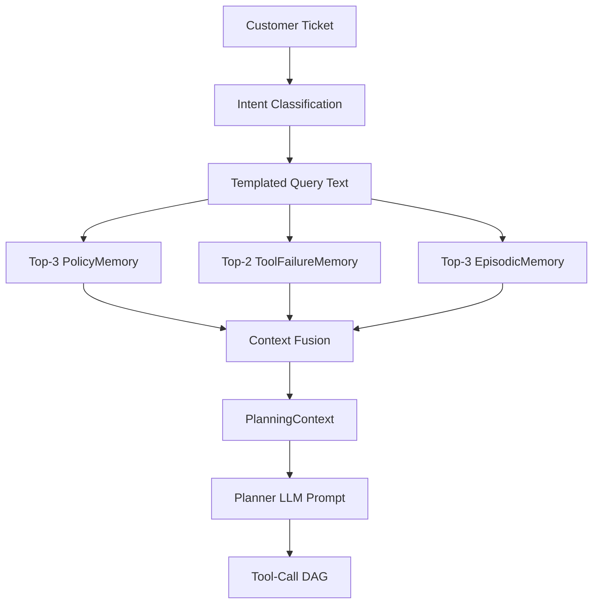
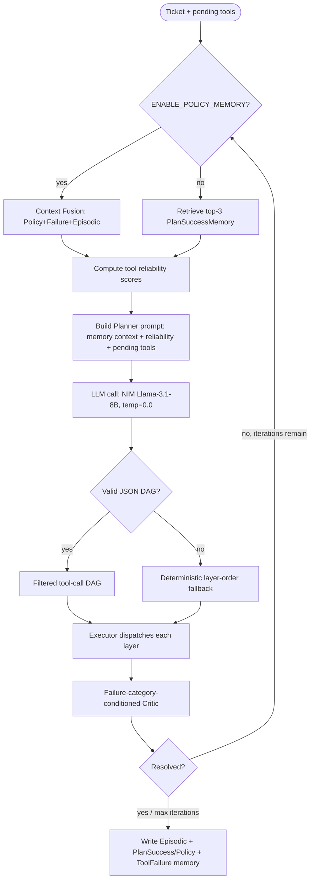

# Methodology

## Experimental Design

A 4-arm, 3-condition factorial design: four planning/memory strategies (arms), each run against
the same 200-ticket dataset at three synthetic tool-failure rates (conditions), for 12
arm×condition cells, 2,400 ticket-runs total.

### Arms

| Arm | Memory retrieved | Critic | Reliability scoring | Notes |
|---|---|---|---|---|
| `memoryless` | none | plain LLM critic | no | replans from scratch every ticket |
| `static_react` | none | fixed ReAct loop | no | no replanning revision, single reasoning pass |
| `memory_augmented` | `PlanSuccessMemory` (top-3, ticket-parameterized) + `ToolFailureMemory` | plain LLM critic | no | Contribution 1 (frozen); the ticket-based memory baseline |
| `policy_memory` | Context Fusion: top-3 `PolicyMemory` + top-2 `ToolFailureMemory` + top-3 `EpisodicMemory` | failure-category-conditioned | yes | Contribution 2; identical critic/reliability-scoring config to `v2_full`, only the retrieval source changes |

`policy_memory` was specifically constructed as an ablation of the same underlying implementation
(`experiments/memory_augmented_v2.py`) that also implements `v2_full`, `v2_critic_only`, and
`v2_template_only` — flipping one environment variable (`ENABLE_POLICY_MEMORY`) swaps the
Planner's retrieved context from `PlanSuccessMemory`-only to the fused Policy+Failure+Episodic
context while leaving the Critic and reliability-scoring machinery untouched. This isolates the
retrieval-source variable *relative to `v2_full`*. This paper reports both comparisons: the
initial one against `memory_augmented` (confounded — `memory_augmented` predates and lacks the
conditioned Critic and reliability scoring both `v2_full` and `policy_memory` share) and, since
the ablation described here was run, the controlled one against `v2_full` — which found no
statistically significant difference at any failure rate tested (see `results.md` Tables 8–11 and
`discussion.md`).

### Conditions

Failure rate (FR) ∈ {0.0, 0.3, 0.7}: the probability that any given tool call is intercepted by a
synthetic failure injector (`src/tools/registry.py::roll_failure`), which — when triggered —
selects uniformly among `timeout`, `ambiguous_data`, and `wrong_result`. `ToolRegistry` is
constructed fresh per ticket with `seed=42`, so failure injection is deterministic given ticket
processing order, held identical across arms for a fair comparison within each condition.

## Dataset

`data/synthetic_tickets_v2.jsonl`: 200 synthetic customer support tickets across 6 intent
clusters:

| Intent cluster | Count | Expected tool sequence |
|---|---|---|
| `order_status` | 42 | crm → order_lookup |
| `refund_request` | 42 | crm → order_lookup → refund |
| `billing_dispute` | 35 | crm → order_lookup → kb_search → refund |
| `account_issue` | 33 | crm → kb_search |
| `complaint_escalation` | 30 | crm → order_lookup → kb_search |
| `general_inquiry` | 18 | kb_search |

180/200 tickets are `standard` phrasing; the remaining 20 are stress-test edge cases (5 each of
`ambiguous`, `contradictory`, `missing_entity`, `multi_intent`) — present in the dataset but not
separately stratified in this paper's results (see `future_work.md`).

## Simulated Tools

Four tools (`crm`, `order_lookup`, `refund`, `kb_search`) are pure simulated-data generators
(`src/tools/{crm,order,refund,kb_search}.py`) — no real backends are called in the research track.
A shared `ToolResult` model carries `success`/`data`/`error` plus an oracle-only `failure_type`
field the Critic is never permitted to read directly (only used post-hoc to score diagnosis
accuracy).

## Policy Memory: Write and Retrieve Semantics

**Write** (on ticket resolution only, mirroring `PlanSuccessMemory`'s existing write-on-success
convention): the resolved DAG's tool-name-only shape becomes `workflow_template`
(e.g., `[["crm"], ["order_lookup"], ["refund"]]` — no ticket-specific values ever appear in a DAG
layer, so no separate text-abstraction step is needed here, unlike `PlanSuccessMemory`'s
templated message). A `dependency_graph` is derived from the tools actually present. A
**deterministic** `policy_id` (SHA-256 of `intent_cluster` + canonical JSON of `workflow_template`)
is computed; if a policy with that id already exists, it is reinforced in place (`usage_count`
incremented, `average_tool_calls`/`average_replans` updated as running means, `confidence`
nudged up, capped at 1.0, `created_from` ticket list extended) via a ChromaDB `upsert`, rather
than appended as a new duplicate record.

**Retrieve** (Context Fusion, at planning time, before any tool is called): merges

- top-3 `PolicyMemory` entries (semantic query against the templated ticket message),
- top-2 `ToolFailureMemory` entries,
- top-3 `EpisodicMemory` entries

into one `PlanningContext`, rendered as a single text block injected into the Planner's LLM
prompt in place of the ticket-based baseline's bare `PlanSuccessMemory` template list.

## Planner Workflow (per ticket, per iteration)

## Metrics

Computed per ticket and aggregated per arm×condition cell (see `results.md` for the full tables;
computation logic is in `scripts/analyze_policy_memory.py::compute_core_metrics` and
`compute_policy_metrics`, and `scripts/analyze_results.py::perform_significance_test` for the
significance test — all reused as-is from the existing codebase, not written for this paper):

- **Resolution Rate** — fraction of tickets where every expected tool was called with a usable
  (non-`not_found`/non-`UNKNOWN`, successful) result.
- **Average Tool Calls** — mean tool invocations per ticket (all attempts, including retries).
- **Average Replanning Count** — mean number of Critic-triggered replan iterations per ticket.
- **Memory Hit Rate** — fraction of tickets where the Planner's memory retrieval (of any kind)
  returned at least one entry.
- **Retrieval Distance** — the nearest memory match's embedding distance at the final planning
  iteration (lower = closer match); undefined for the two memoryless arms.
- **Average Latency** — mean wall-clock time (ms) for one ticket's full `run()` call, including
  all LLM and simulated tool calls.
- **Policy Retrieval Rate** *(Policy Memory arm only)* — fraction of tickets where at least one
  `PolicyMemory` entry was retrieved.
- **Policy Reuse Rate** *(Policy Memory arm only)* — of tickets that retrieved a policy, the
  fraction where that policy's `usage_count` at retrieval time was already ≥ 2 (i.e., it had been
  reinforced by at least one *earlier* ticket, not merely just created).
- **Distinct Policies Used** — count of unique `policy_id`s retrieved within a condition; a
  JSONL-derived proxy for policy-store growth (see `limitations.md`).

## Statistical Testing

A χ² test of independence (`scipy.stats.chi2_contingency`) on the 2×2 contingency table
(resolved/failed × arm) for each pairwise arm comparison within a condition, exactly as
implemented in the pre-existing `scripts/analyze_results.py::perform_significance_test` (imported,
not re-implemented, for this paper's analysis).
